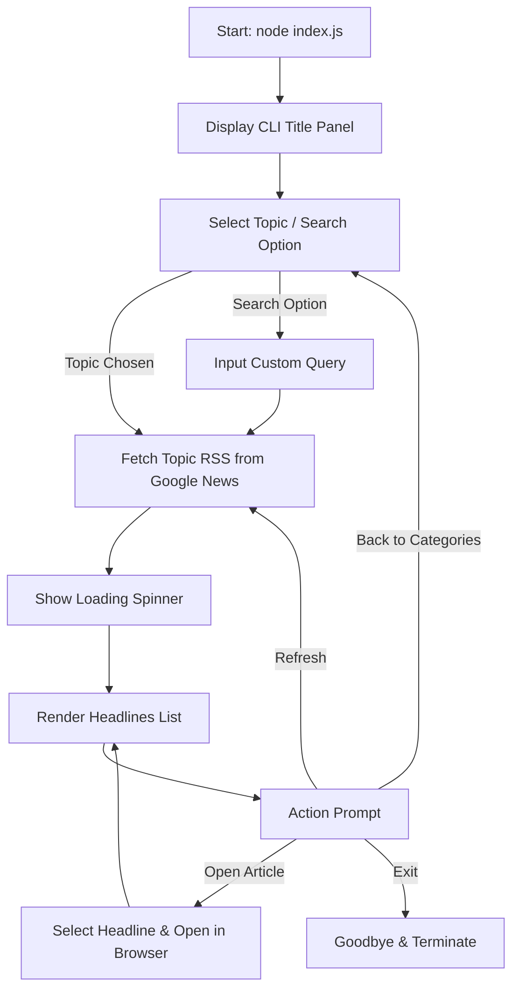

# Google News CLI

A premium, interactive command-line interface (CLI) application built with Node.js to fetch, search, and read the latest news from Google News directly inside your terminal.

---

## Architecture & Workflow

The application operates as an interactive CLI loop, enabling real-time navigation and search. Here is how the components and data flows are structured:



---

## Features & Visual Design

- 🌐 **Latest Headlines**: Instantly fetch top stories or browse by categories.
- 📂 **Interactive Category Selector**: Navigate categories using arrow keys (World, Business, Technology, Science, Health, Sports, Entertainment).
- 🔍 **Custom Search**: Search Google News for any keyword or phrase.
- ⚡ **Direct Link Redirection**: Select any article in the terminal and launch it in your default web browser. Google News RSS URLs are used directly, ensuring redirects work automatically and stably in the browser.
- 🎨 **Visual Aesthetics**: Built using `chalk` for color gradients, `boxen` for layout panels/borders, `ora` for high-quality terminal spinner loaders, and `prompts` for interactive selectors.

---

## Component Details

### 1. [`package.json`](file:///Users/dathwik/first-project/package.json)
Initializes the Node.js project using ES Modules (`"type": "module"`) and handles dependencies:
- **`rss-parser`**: Feeds XML parser.
- **`prompts`**: CLI selector prompts.
- **`chalk`** & **`boxen`** & **`ora`**: Output aesthetics.
- **`open`**: Spawns default browser processes.

### 2. [`index.js`](file:///Users/dathwik/first-project/index.js)
The entry point of the CLI application:
1. Shows a beautiful cyan greeting banner.
2. Prompts user to choose a category or search.
3. Fetches Google News RSS feeds using `rss-parser`.
4. Parses title, source, publication date, and redirect links.
5. Displays news in cards.
6. Handles actions (Refresh, browser redirection, changing category, or exiting).

---

## Installation & Setup

### Prerequisites
- **Node.js** (version 18 or higher recommended)
- **npm** (included with Node.js)

### Installation
Clone the repository or navigate to your local project directory, then run:

```bash
# Install dependencies
npm install
```

### Global Linking
To install the CLI globally so that you can run it from any directory on your computer:

```bash
# Create a global symlink
npm link
```

---

## Usage

If you linked the application globally, you can run it from anywhere using:

```bash
google-news
```

Otherwise, run it locally via Node in the project directory:

```bash
node index.js
```

---

## Verification & Testing

The application has been verified under standard Node environments:
- **Interactive UI**: Verified arrow keys, lists, selection behaviors, and graceful exit routines.
- **Data Integration**: Successfully parses Google News RSS structures and handles network requests with loading states.
- **Browser Redirection**: Spawns browser tabs pointing to the destination articles correctly.
